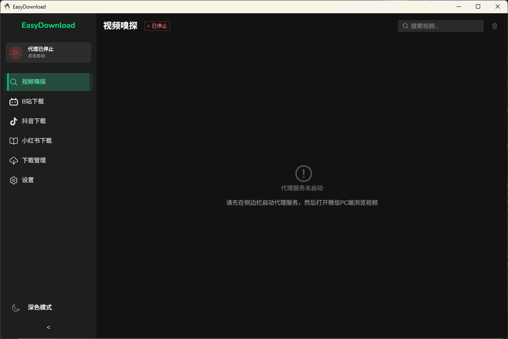
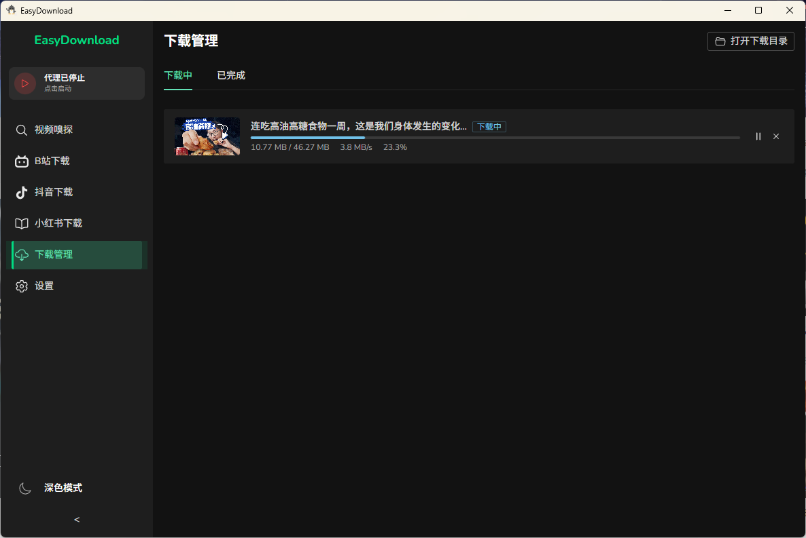

# EasyDownload

[English](README_EN.md) | 简体中文

一款简洁易用的桌面视频下载器，支持微信视频号、B站、小红书、抖音等多平台内容下载。

## 功能特点

- **视频号嗅探下载**：自动检测微信PC端播放的视频号视频，一键下载
- **B站视频下载**：支持 BV号、av号、普通视频链接，以及番剧/影视 ep、ss、md 链接，多画质选择
- **小红书下载**：支持小红书视频和图片笔记下载
- **抖音下载**：支持抖音视频下载，包括图集作品预览与下载
- **可视化界面**：Netflix 风格的视频卡片展示，清晰的下载进度
- **可靠下载**：内置下载队列、断点续传、状态持久化和失败/取消分组
- **本地安全边界**：内部 API 和代理默认只监听 `127.0.0.1`，并对浏览器访问加 token 校验
- **零配置目标**：自动化证书安装和代理设置，降低使用门槛

## 预览截图



### 视频嗅探


### B站下载



### 抖音下载


## 技术栈

- **前端**: Vue 3 + TypeScript + Naive UI + Tailwind CSS
- **后端**: Go
- **桌面框架**: Wails v2

## 使用说明

### 首次使用

> 如果不需要使用视频号嗅探功能，可跳过此步骤。

1. **以管理员身份运行** EasyDownload.exe
2. 进入「设置」页面，点击「安装证书」按钮安装 CA 根证书
3. 返回主页面，点击侧边栏的「启动代理」按钮

### 下载视频号视频

1. 确保代理服务已启动（侧边栏显示绿色运行状态）
2. 打开**微信 PC 端**，浏览视频号内容
3. 检测到的视频会自动显示在「视频嗅探」页面
4. 点击视频卡片上的「下载」按钮即可下载

> 代理和内部 API 默认只绑定本机回环地址。MITM 只作用于视频号页面/脚本白名单域名，视频 CDN 和其他 HTTPS 流量默认直连。

### 下载B站视频

1. 进入「B站下载」页面
2. 粘贴B站视频链接（支持 BV号、av号、普通视频链接、番剧/影视 ep/ss/md 链接）
3. 点击「解析」按钮获取视频信息
4. 普通视频选择画质后点击「下载视频」；番剧默认下载当前集，也可「展开全部」多选剧集

### 下载小红书内容

1. 进入「小红书」页面
2. 粘贴小红书笔记链接或分享文本
3. 点击「解析」按钮获取内容信息
4. 支持下载视频笔记或批量保存图片笔记

### 下载抖音视频

1. 进入「抖音」页面
2. 粘贴抖音视频链接或分享文本
3. 点击「解析」按钮获取视频信息
4. 支持预览图集作品，点击下载保存视频

## 下载与安全说明

- 下载任务会进入统一队列；超过并发上限时保持等待，不会因为“并发已满”直接丢失。
- 新任务状态保存在本地数据目录的 `downloads.v2.json`，普通 URL、微信、B站、抖音和小红书任务都可凭持久化的 `PlatformData` 恢复；旧版 `downloads.json` 不自动导入且保持原样，任务页会显示一次保留/回滚提示。
- 图片代理会阻止 localhost、私网、link-local、metadata 等地址，避免被用于内网探测。
- 更多实现细节见 [安全边界与下载可靠性说明](docs/security-and-download-reliability.md)。

## 开发说明

### 环境要求

- Go 1.23+
- Node.js 20+
- Wails CLI v2.11.0

### 安装 Wails CLI

```bash
go install github.com/wailsapp/wails/v2/cmd/wails@v2.11.0
```

### 开发模式

```bash
wails dev
```

### 构建

```bash
wails build
```

构建产物位于 `build/bin/` 目录。

### Settings / Wails 绑定约定

用户设置只通过 `GetSettings` / `UpdateSettings` 读写；`GetAppInfo` 仅返回运行时元数据。修改后端绑定后运行：

```bash
go run github.com/wailsapp/wails/v2/cmd/wails@v2.11.0 generate module -nocolour
git diff --exit-code -- frontend/wailsjs
```

生成的 `frontend/wailsjs/` 不得手工编辑。旧字段级设置绑定由 `frontend/settings-bindings.denylist.txt` 和前端测试阻止重新引入。

`UpdateSettings` 是事务接口：critical 运行态副作用在提交失败时回滚；运行中的代理端口变更通过 `restartRequirements(scope=proxy)` 明确提示停止并重启代理；best-effort 同步失败不会推翻已落盘设置，而是通过 `warnings` 返回。前端调用者必须展示并处理 `warnings` 与 `restartRequirements`。

## 项目结构

```
EasyDownload/
├── app.go                 # Wails 应用主入口
├── main.go                # 程序入口
├── internal/
│   ├── api/               # 内部 API 服务器
│   ├── download/        # 下载管理器、各平台下载器
│   ├── proxy/             # MITM 代理、证书管理
│   └── utils/             # 工具函数
├── frontend/
│   ├── src/
│   │   ├── views/         # 页面组件
│   │   ├── stores/        # Pinia 状态管理
│   │   ├── router/        # Vue Router
│   │   └── types/         # TypeScript 类型
│   └── wailsjs/           # Wails 生成的绑定
└── build/
    └── bin/               # 构建产物
```

## 免责声明

本项目仅供学习和技术研究使用。请遵守相关法律法规，尊重内容创作者的权益。下载的内容仅供个人学习使用，请勿用于商业目的或非法传播。

## License

[MIT](LICENSE)
